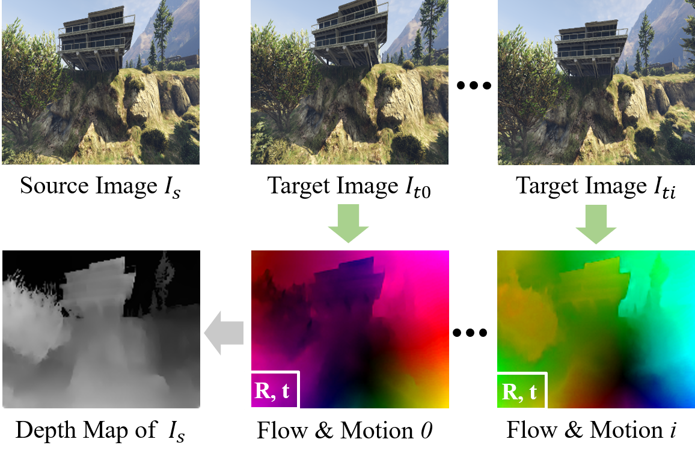

# Flow-Motion-Depth

This is the project page of the paper **"Flow-Motion and Depth Network for Monocular Stereo and Beyond''**.

This project page contians:

* the implementation of the method,

* the GTA-SfM tools and generated dataset.

All components will be open source once the paper is accepted.

## The proposed method

In this work we propose a method that sloves monocular stereo and can further fuse depth information from multiple target images. The inputs and outputs of the method can be illustrated in the figure below. Given a source image, and one or many target images, the proposed method estimates the optical flow and relative poses between each source-target pair. The depth map of the source image is also estimated by fusing optical flow and pose information.

## The proposed dataset and tools

Training and evaluating neural networks require large-scale high-quality data. Different from the widely used dataset from [DeMoN](https://github.com/lmb-freiburg/demon), we propose to render the dataset in GTA5 as a supplementary. A similiar data, MVS-Synth, is proposed in [DeepMVS](https://phuang17.github.io/DeepMVS/index.html). Cameras in the MVS-Synth dataset usually moves in small translations. On the other hand, the proposed GTA-SfM dataset contains images with much larger view angle changes which is more close to structure-from-motion (SfM) applications. Below is the comparision of the proposed GTA-SfM (left) and MVS-Synth (right).

  
  

