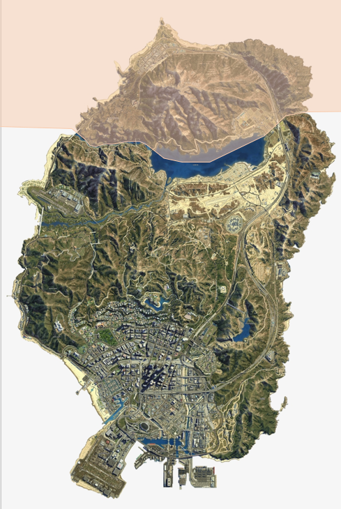

# GTA-SfM Dataset

Here, we publish the extracted dataset from GTA5.

## Details you should know

* The dataset contains images sequences. Each image is associated with a depth map and camera pose.

* We split the game into 2 regions such that raining data and test data are sampled with no overlaps. The split is illustrated as following. Test images are sampled in pink areas and training images are sampled in the rest areas.

<p align="center">

</p>

* There exists domian differences that the training datas constains many city environments and the test data contains many rural environments. Since our method relies on multiview geometry, such difference is not a big issue. For other methods, you may want to consider the difference.

## Data link

You can download the dataset via Dropbox: [train](https://www.dropbox.com/sh/qthq0sume2e618n/AADc2_V_w1WZhxkhATMxq_xSa?dl=0), [test](https://www.dropbox.com/s/2k4tbmuragjg5bk/test.tar?dl=0). We also provide a sample sequence for you: [sample](https://www.dropbox.com/s/71mq9inzqg254u3/20190124_203632.hdf5?dl=0).

## Parser

We provide example scripts to read images and camera poses from the packed dataset. See ```read.py``` for details.

